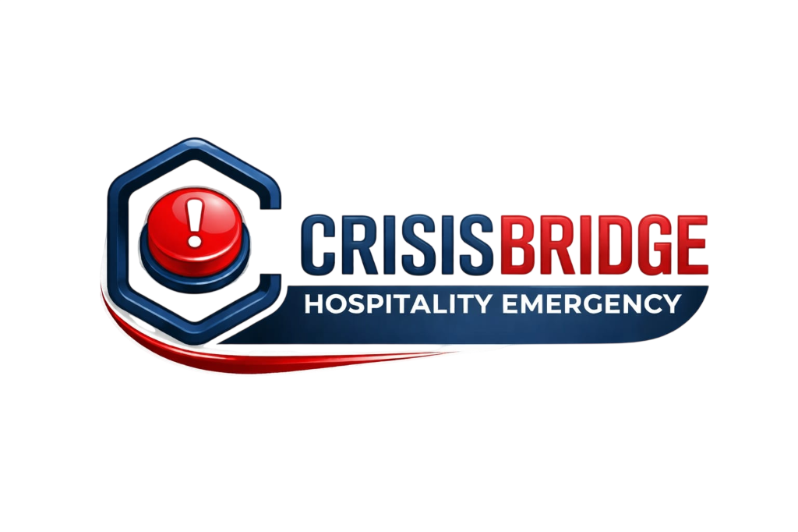

<div align="center">



<br/>

# 🆘 Crisis Bridge

### *One Tap. Every Responder. Zero Delay.*

**A real-time emergency response platform that connects hotel guests, staff, and admins the moment a crisis begins — powered by Firebase and Google Gemini AI.**

<br/>

[](https://crisis-bridge.web.app)
&nbsp;
[](https://react.dev/)
&nbsp;
[](https://firebase.google.com/)
&nbsp;
[](https://ai.google.dev/)

</div>

---

## 💡 The Problem

Every year, hotels face a painful gap between the moment a guest is in danger and the moment help arrives.

> A guest has a cardiac arrest in room 412. They call the front desk. The front desk calls the manager. The manager radios a staff member. The staff member asks, *"Which floor?"*

That chain of phone calls, walkie-talkies, and confusion costs **minutes**. In emergencies, minutes cost lives.

**Crisis Bridge eliminates that chain entirely.**

---

## 🚀 What We Built

Crisis Bridge is a **unified, real-time emergency coordination platform** for the hospitality industry. The moment a guest taps SOS:

- The correct staff members — matched by emergency type — receive an **instant alert popup with an alarm sound**
- The **exact room number and floor** are displayed
- A **per-incident chat room** opens between the guest and their responder
- A **Gemini AI chatbot** auto-opens on the guest's screen with step-by-step safety instructions specific to the emergency type
- The **admin dashboard** shows the live room grid pulsing with the active alert

From tap to staff acknowledgment: **under 2 seconds.**

---

## 🎥 Demo

> 📹 **[Watch the 2-minute demo →](#)**  
> 🌐 **[Try the live app →](https://crisis-bridge.web.app)**

**Quick login credentials for judges:**

| Role | Email | Password |
|---|---|---|
| 👤 Guest | `guest@demo.com` | `demo1234` |
| 🧑‍🚒 Staff | `staff@demo.com` | `demo1234` |
| 🛡️ Admin | `admin@demo.com` | `demo1234` |

---

## ✨ Feature Highlights

### 🔴 One-Tap SOS — 4 Emergency Types
Guests select their emergency type and tap. That's it.

| Emergency | Who Gets Alerted | AI Response |
|---|---|---|
| 🔥 **Fire** | Fire safety staff + all general staff | Evacuation route, stay-low instructions |
| ⚕️ **Medical** | Medical staff + general staff | First aid steps, conscious/breathing check |
| 🛡️ **Security** | Security staff + general staff | Lock door, move from windows, do not confront |
| 🆘 **Common** | All on-duty staff | Immediate context triage |

### 🤖 Gemini AI Safety Companion
The moment a guest triggers SOS, a Gemini 1.5 Flash chatbot **automatically opens** with an emergency-specific message. No prompting required — the AI already knows the room number and emergency type, and stays in an interactive Q&A mode to guide the guest until help arrives.

### 📡 Firebase Realtime Architecture
We use **two Firebase databases in parallel** — by design:
- **Realtime Database** (`rtdb`) → for SOS alerts and chat (sub-second latency, fire-and-forget)
- **Firestore** (`db`) → for structured incident documents with full audit timelines

This hybrid approach lets us get instant UI updates for active emergencies while preserving queryable, permanent incident records.

### 🧑‍🚒 Smart Staff Routing
Staff are assigned a **designation** (Fire, Medical, Security, General) when onboarded. The `useSOS` hook filters incoming alerts — a Medical responder only sees Medical and Common SOS, not Security. No alert noise. Right person, right time.

### 🏨 Admin Command Centre
The admin dashboard gives a **live visual floor plan** of the hotel. Every room block turns red/orange/blue the moment an SOS fires. Admins see:
- Active incidents with assigned staff and elapsed time
- Computed average response time across all resolved incidents today
- Staff roster with on-duty presence status
- Full incident history with filterable audit timeline

---

## 🛠 Tech Stack

```
Frontend      React 19 + Vite 8 + Tailwind CSS 3
Routing       React Router DOM 7
Auth          Firebase Authentication
Real-Time DB  Firebase Realtime Database  ← SOS alerts & chat
Persistent DB Firebase Firestore          ← Incidents & audit logs
Hosting       Firebase Hosting
AI            Google Gemini 1.5 Flash API
Notifications react-hot-toast
Icons         Lucide React + Google Material Symbols
```

---

## 🏗 How It Works — Under the Hood

```
Guest taps SOS
      │
      ▼
sosService.triggerSOS()
      │
      ├──▶ rtdb/sos/{hotelCode}/{roomNumber}    ← instant broadcast
      │         │
      │         └──▶ useSOS() hook on every on-duty staff device
      │                   └──▶ SOSPopup modal + alarm sound
      │
      └──▶ firestore/incidents/{incidentId}     ← structured audit doc
                │
                └──▶ Timeline: [TRIGGERED → ACCEPTED → ARRIVED → RESOLVED]

Staff accepts
      │
      ├──▶ Firestore incident.response.assignedStaffId updated
      ├──▶ rtdb/chat/{incidentId} — system message posted
      └──▶ Guest's ChatWindow updates in real-time

Staff resolves
      │
      ├──▶ rtdb/sos/{hotelCode}/{roomNumber} CLEARED
      ├──▶ firestore incident.status = 'resolved'
      └──▶ Timeline appended: RESOLVED with notes + timestamp
```

---

## 📁 Project Structure

```
src/
├── pages/
│   ├── Landing.jsx              # Public marketing page
│   ├── auth/                    # Login + Signup
│   ├── guest/                   # SOS dashboard, history, hotel check-in
│   ├── staff/                   # 5-tab command centre, profile, pending approval
│   └── admin/                   # Dashboard, staff management, incident log
│
├── components/
│   ├── sos/       SOSButton, RoomGrid, IncidentCard, RoomBlock
│   ├── chat/      ChatWindow, ChatInput, ChatMessage
│   ├── guest/     GuestGeminiChatbot, GuestSidebar
│   ├── staff/     SOSPopup, OnDutyToggle, StaffSidebar
│   └── admin/ai/  AdminAIChatbot
│
├── services/      sosService, chatService, staffService, hotelService
├── hooks/         useSOS, useSOSListener, useChat, usePresence, useRooms
├── firebase/      config, firestore helpers, realtime helpers
├── contexts/      AuthContext, ThemeContext
└── utils/         incidentId builder, floor parser, time formatter
```

---

## ⚡ Run It Locally

```bash
git clone https://github.com/Cody-Abhi/CrisisBridge.git
cd CrisisBridge
npm install
```

Create a `.env` file:

```env
VITE_FIREBASE_API_KEY=...
VITE_FIREBASE_AUTH_DOMAIN=...
VITE_FIREBASE_DATABASE_URL=...
VITE_FIREBASE_PROJECT_ID=...
VITE_FIREBASE_STORAGE_BUCKET=...
VITE_FIREBASE_MESSAGING_SENDER_ID=...
VITE_FIREBASE_APP_ID=...
VITE_FIREBASE_MEASUREMENT_ID=...
VITE_GEMINI_API_KEY=...
```

```bash
npm run dev   # → http://localhost:5173
```

---

## 🔮 What's Next

- [ ] **WebRTC Voice Calls** — direct audio between guest and responder, no phone required
- [ ] **Push Notifications** — alert staff even when the browser is closed (Firebase FCM)
- [ ] **Multi-Hotel Admin** — a super-admin layer for hotel chains managing many properties
- [ ] **Native Mobile App** — React Native port for guests with background SOS capability
- [ ] **Offline SOS Queuing** — ServiceWorker-based queue so SOS fires even on poor connections
- [ ] **Analytics Dashboard** — weekly/monthly response time trends and staff performance charts

---

## 👨‍💻 The Team

Built at Clt Alt Elite.

| | Name | Role |
|---|---|---|
| ⚡ | Aakanksha Mishra | Frontend Designer |
| 🧠 | Aastha Dubey | Frontend, UI/UX |
| 🧠 | Abhinav Srivastava | Backend, Firebse configuration |


---

## 🏆 Why Crisis Bridge Wins

Most hotel emergency systems are either expensive hardware installations or rely on staff carrying radios. Crisis Bridge is:

- **Software-only** — works on any phone, no hardware needed
- **AI-first** — guests get intelligent guidance before help even arrives
- **Under 2 seconds** — from tap to alert, every time
- **Role-aware** — the right person is always notified, no noise
- **Built in a hackathon** — full auth, real-time DB, AI chatbot, multi-role dashboard, incident audit trail, and dark mode, shipped in one sprint

---

<div align="center">

*"The difference between a good emergency response system and a great one is measured in seconds."*

**Crisis Bridge** — built to make every second count. 🆘

</div>
